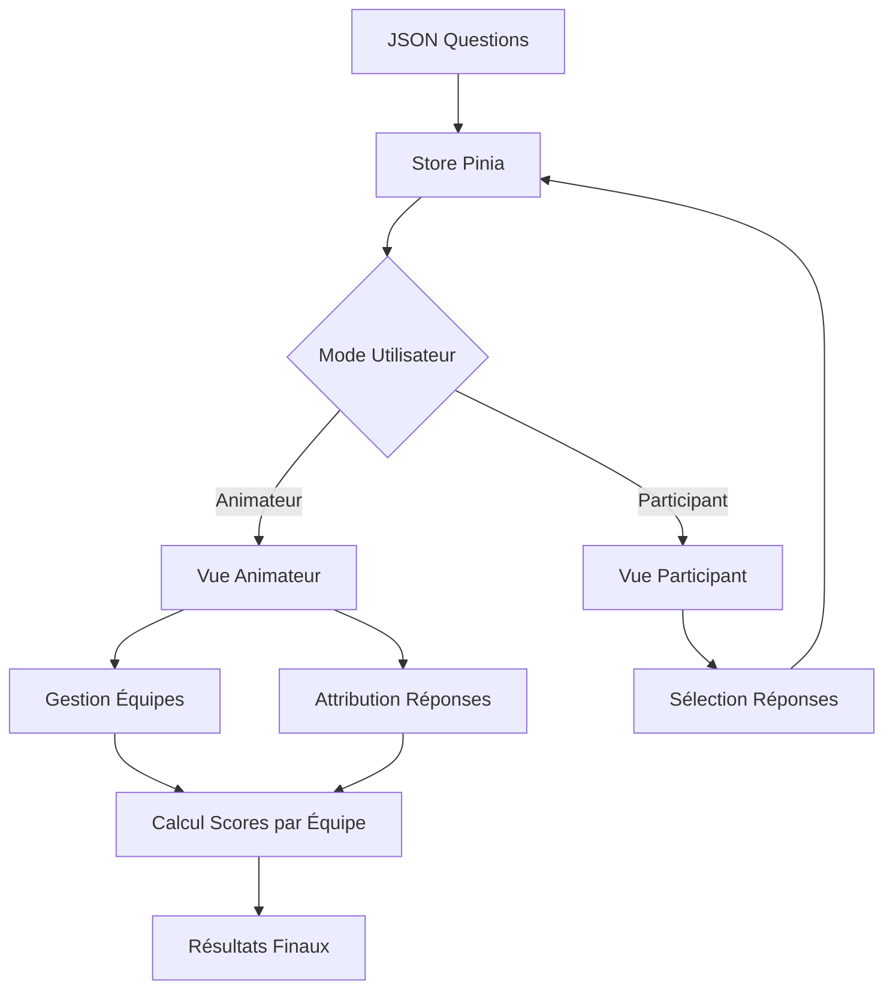

# Document de Conception

## Vue d'ensemble

L'application Quiz Cinéma est une Progressive Web App (PWA) mobile-first développée en Vue3 avec Composition API et UnoCSS. Elle utilise une architecture modulaire avec des composants réutilisables, un système de gestion d'état réactif, et un design system moderne inspiré de l'esthétique UnoCSS avec support des thèmes clair/sombre.

L'application distingue deux modes d'utilisation distincts :
- **Mode Animateur** : Gestion des équipes, attribution des réponses aux équipes, contrôle du déroulement et accès aux résultats détaillés
- **Mode Participant** : Navigation libre dans les questions, sélection des réponses sans feedback immédiat

L'application suit le principe "mobile-first" avec une interface tactile optimisée, des animations rainbow dynamiques, et une expérience utilisateur moderne utilisant les conventions et classes utilitaires atomiques d'UnoCSS.

## Architecture

### Architecture Technique
```
src/
├── components/           # Composants Vue réutilisables
│   ├── ui/              # Composants UI de base (Button, Card, etc.)
│   ├── quiz/            # Composants spécifiques au quiz
│   └── layout/          # Composants de mise en page
├── composables/         # Logique métier réutilisable (Vue3 Composition API)
├── stores/              # Gestion d'état (Pinia)
├── data/                # Fichiers JSON des questions
├── assets/              # Ressources statiques (CSS, images)
├── router/              # Configuration Vue Router
└── utils/               # Fonctions utilitaires
```

### Architecture des Données
- **Questions JSON** : Structure hiérarchique avec catégories et métadonnées
- **État de l'application** : Gestion réactive avec Pinia (équipes, mode utilisateur, réponses par équipe)
- **Persistance locale** : LocalStorage pour les sessions et configurations d'équipes
- **Gestion des modes** : Distinction entre vue animateur et vue participant

### Flux de Données


## Composants et Interfaces

### Composants Principaux

#### 1. AppLayout
- **Responsabilité** : Structure générale de l'application
- **Props** : Aucune
- **Émissions** : Aucune
- **État** : Gestion du thème et de l'orientation

#### 2. TeamSetup
- **Responsabilité** : Gestion des équipes avant le quiz (mode animateur uniquement)
- **Props** : Aucune
- **Émissions** : `teams-configured`, `start-quiz`
- **État** : Liste des équipes, équipe en cours d'édition

#### 3. QuizContainer
- **Responsabilité** : Orchestration du quiz complet avec gestion des modes
- **Props** : `questions: Question[]`, `userMode: 'host' | 'participant'`
- **Émissions** : `quiz-completed`, `quiz-reset`
- **État** : Index question courante, progression, mode utilisateur

#### 4. QuestionCard
- **Responsabilité** : Affichage d'une question avec ses réponses (adapté selon le mode)
- **Props** : `question: Question`, `questionNumber: number`, `totalQuestions: number`, `userMode: string`
- **Émissions** : `answer-selected`, `team-answer-assigned`
- **État** : Réponse sélectionnée, équipes assignées (mode animateur)

#### 5. AnswerButton
- **Responsabilité** : Bouton de réponse interactif (comportement différent selon le mode)
- **Props** : `answer: string`, `isCorrect: boolean`, `isSelected: boolean`, `showResult: boolean`, `userMode: string`
- **Émissions** : `click`, `team-assignment-requested`
- **État** : État visuel (normal, sélectionné, correct, incorrect)

#### 6. TeamAssignmentModal
- **Responsabilité** : Modal pour assigner une réponse à une équipe (mode animateur)
- **Props** : `teams: Team[]`, `selectedAnswer: string`, `isVisible: boolean`
- **Émissions** : `team-selected`, `modal-closed`
- **État** : Équipe sélectionnée

#### 7. ProgressBar
- **Responsabilité** : Indicateur de progression visuel
- **Props** : `current: number`, `total: number`
- **Émissions** : Aucune
- **État** : Pourcentage calculé

#### 8. TeamResultsDisplay
- **Responsabilité** : Affichage des résultats par équipe (mode animateur uniquement)
- **Props** : `teams: Team[]`, `questions: Question[]`, `teamAnswers: TeamAnswer[]`
- **Émissions** : `restart`, `home`
- **État** : Scores calculés, classement des équipes

### Interfaces TypeScript

```typescript
interface Question {
  id: string;
  question: string;
  answers: string[];
  correctAnswer: number;
  category?: string;
  difficulty?: 'easy' | 'medium' | 'hard';
  explanation?: string;
}

interface Team {
  id: string;
  name: string;
  score: number;
  color?: string;
}

interface TeamAnswer {
  questionId: string;
  teamId: string;
  answerIndex: number;
  isCorrect: boolean;
}

interface QuizState {
  questions: Question[];
  teams: Team[];
  currentQuestionIndex: number;
  userMode: 'host' | 'participant';
  teamAnswers: TeamAnswer[];
  isCompleted: boolean;
  startTime: Date;
  endTime?: Date;
  // Pour le mode participant
  participantAnswers: number[];
  // Pour le mode animateur
  currentQuestionTeamAssignments: Map<number, string[]>; // answerIndex -> teamIds
}

interface AppTheme {
  primary: string;
  secondary: string;
  accent: string;
  background: string;
  surface: string;
  text: string;
}

interface QuestionResults {
  questionId: string;
  correctAnswer: number;
  teamAnswers: {
    teamId: string;
    teamName: string;
    answerIndex: number;
    isCorrect: boolean;
  }[];
}
```

## Modèles de Données

### Structure JSON des Questions
```json
{
  "metadata": {
    "title": "Quiz Cinéma Soirée Filles",
    "version": "1.0",
    "totalQuestions": 20,
    "categories": ["Romance", "Comédie", "Drame", "Acteurs", "Réalisateurs"]
  },
  "questions": [
    {
      "id": "q001",
      "question": "Dans quel film Julia Roberts dit-elle 'Big mistake. Big. Huge!' ?",
      "answers": [
        "Pretty Woman",
        "Notting Hill", 
        "My Best Friend's Wedding",
        "Erin Brockovich"
      ],
      "correctAnswer": 0,
      "category": "Romance",
      "difficulty": "medium",
      "explanation": "Cette réplique culte est prononcée dans Pretty Woman lors de la scène du shopping."
    }
  ]
}
```

### Store Pinia - Quiz Store
```typescript
export const useQuizStore = defineStore('quiz', () => {
  const state = reactive<QuizState>({
    questions: [],
    teams: [],
    currentQuestionIndex: 0,
    userMode: 'participant',
    teamAnswers: [],
    isCompleted: false,
    startTime: new Date(),
    endTime: undefined,
    participantAnswers: [],
    currentQuestionTeamAssignments: new Map()
  });

  const currentQuestion = computed(() => 
    state.questions[state.currentQuestionIndex]
  );

  const progress = computed(() => 
    (state.currentQuestionIndex / state.questions.length) * 100
  );

  const teamScores = computed(() => 
    state.teams.map(team => ({
      ...team,
      score: state.teamAnswers
        .filter(answer => answer.teamId === team.id && answer.isCorrect)
        .length
    }))
  );

  const canProceedToNextQuestion = computed(() => {
    if (state.userMode === 'participant') return true;
    
    // En mode animateur, toutes les équipes doivent être assignées
    const currentAssignments = state.currentQuestionTeamAssignments;
    const totalAssignedTeams = Array.from(currentAssignments.values())
      .flat().length;
    
    return totalAssignedTeams >= state.teams.length;
  });

  const questionResults = computed(() => 
    state.questions.map(question => ({
      questionId: question.id,
      correctAnswer: question.correctAnswer,
      teamAnswers: state.teamAnswers
        .filter(answer => answer.questionId === question.id)
        .map(answer => {
          const team = state.teams.find(t => t.id === answer.teamId);
          return {
            teamId: answer.teamId,
            teamName: team?.name || 'Équipe inconnue',
            answerIndex: answer.answerIndex,
            isCorrect: answer.isCorrect
          };
        })
    }))
  );

  return { 
    state, 
    currentQuestion, 
    progress, 
    teamScores, 
    canProceedToNextQuestion,
    questionResults 
  };
});
```

## Logique Métier Spécifique

### Gestion des Modes Utilisateur

#### Mode Animateur
- **Configuration des équipes** : Création, édition, suppression d'équipes avant le quiz
- **Attribution des réponses** : Sélection d'une réponse déclenche un modal d'attribution d'équipe
- **Contrôle du flux** : Ne peut passer à la question suivante qu'après attribution de toutes les équipes
- **Révélation des réponses** : Voit la bonne réponse uniquement après attribution complète
- **Accès aux résultats** : Vue détaillée des scores par équipe et par question

#### Mode Participant
- **Navigation libre** : Peut naviguer entre toutes les questions (précédent/suivant)
- **Sélection sans feedback** : Sélectionne des réponses sans indication de justesse
- **Pas de contraintes** : Peut changer de question à tout moment
- **Pas d'accès aux résultats** : Ne voit pas les scores finaux

### Algorithme d'Attribution des Réponses

```typescript
// Logique d'attribution en mode animateur
const assignAnswerToTeam = (questionId: string, answerIndex: number, teamId: string) => {
  // Vérifier si l'équipe a déjà une réponse pour cette question
  const existingAnswer = state.teamAnswers.find(
    answer => answer.questionId === questionId && answer.teamId === teamId
  );
  
  if (existingAnswer) {
    // Mettre à jour la réponse existante
    existingAnswer.answerIndex = answerIndex;
    existingAnswer.isCorrect = answerIndex === currentQuestion.value.correctAnswer;
  } else {
    // Créer une nouvelle réponse
    state.teamAnswers.push({
      questionId,
      teamId,
      answerIndex,
      isCorrect: answerIndex === currentQuestion.value.correctAnswer
    });
  }
  
  // Mettre à jour les assignations pour la question courante
  updateCurrentQuestionAssignments(answerIndex, teamId);
};
```

### Calcul des Scores

```typescript
// Calcul des scores par équipe
const calculateTeamScores = () => {
  return state.teams.map(team => {
    const correctAnswers = state.teamAnswers.filter(
      answer => answer.teamId === team.id && answer.isCorrect
    ).length;
    
    return {
      ...team,
      score: correctAnswers,
      percentage: Math.round((correctAnswers / state.questions.length) * 100)
    };
  }).sort((a, b) => b.score - a.score); // Tri par score décroissant
};
```

## Gestion des Erreurs

### Stratégie de Gestion d'Erreurs
1. **Chargement des questions** : Fallback vers questions par défaut
2. **Erreurs réseau** : Mode hors-ligne avec cache local
3. **Erreurs de validation** : Messages utilisateur friendly
4. **Erreurs critiques** : Page d'erreur avec option de redémarrage
5. **Erreurs de mode** : Validation du mode utilisateur et redirection appropriée
6. **Erreurs d'équipes** : Validation des équipes avant démarrage du quiz

### Composant ErrorBoundary
```vue
<template>
  <div v-if="hasError" class="error-container">
    <h2>Oups ! Quelque chose s'est mal passé</h2>
    <p>{{ errorMessage }}</p>
    <button @click="retry" class="retry-button">Réessayer</button>
  </div>
  <slot v-else />
</template>
```

### Validation des États

```typescript
// Validation avant démarrage du quiz
const validateQuizStart = () => {
  if (state.userMode === 'host' && state.teams.length === 0) {
    throw new Error('Au moins une équipe doit être créée pour démarrer le quiz');
  }
  
  if (state.questions.length === 0) {
    throw new Error('Aucune question chargée');
  }
  
  return true;
};
```

## Stratégie de Test

### Tests Unitaires (Vitest)
- **Composants** : Rendu, props, émissions, interactions utilisateur
- **Composables** : Logique métier, calculs, états
- **Stores** : Actions, mutations, getters
- **Utilitaires** : Fonctions pures, transformations de données

### Tests d'Intégration
- **Flux complet de quiz** : De la première question au score final
- **Navigation** : Transitions entre écrans
- **Persistance** : Sauvegarde/restauration d'état

### Tests E2E (Playwright)
- **Parcours utilisateur complet** : Quiz de bout en bout
- **Responsive design** : Tests sur différentes tailles d'écran
- **Performance** : Temps de chargement, fluidité des animations

### Couverture de Tests
- **Objectif** : 90% de couverture de code
- **Priorité** : Logique métier et interactions critiques
- **Outils** : Vitest pour coverage, Playwright pour E2E

## Design System UnoCSS

### Système de Couleurs et Thématisation

#### Variables CSS UnoCSS (--vp-c-*)
```css
:root {
  /* Mode Clair - Couleurs de marque */
  --vp-c-brand-1: #3451b2;
  --vp-c-brand-2: #3a5ccc;
  --vp-c-brand-3: #5672cd;
  --vp-c-brand-next: #009ff7;
  
  /* Mode Clair - Arrière-plans */
  --vp-c-bg: #ffffff;
  --vp-c-bg-alt: #f6f6f7;
  --vp-c-bg-soft: #f9f9f9;
  
  /* Mode Clair - Texte */
  --vp-c-text-1: #3c3c43;
  --vp-c-text-2: #6e6e73;
  --vp-c-text-3: #929295;
  
  /* Mode Clair - Bordures */
  --vp-c-divider: #e2e2e3;
  --vp-c-border: #c9c9c9;
  
  /* Couleurs sémantiques */
  --vp-c-green-1: #18794e;
  --vp-c-green-soft: rgba(16, 185, 129, 0.14);
  --vp-c-yellow-1: #915930;
  --vp-c-yellow-soft: rgba(255, 197, 23, 0.16);
  --vp-c-red-1: #b8272c;
  --vp-c-red-soft: rgba(244, 63, 94, 0.14);
  --vp-c-purple-1: #8e18aa;
  --vp-c-purple-soft: rgba(159, 122, 234, 0.14);
}

.dark {
  /* Mode Sombre - Couleurs de marque */
  --vp-c-brand-1: #a8b1ff;
  --vp-c-brand-2: #5c73e7;
  --vp-c-brand-3: #3451b2;
  --vp-c-brand-next: #70d0ff;
  
  /* Mode Sombre - Arrière-plans */
  --vp-c-bg: #1b1b1f;
  --vp-c-bg-alt: #161618;
  --vp-c-bg-soft: #202127;
  
  /* Mode Sombre - Texte */
  --vp-c-text-1: #dfdfd6;
  --vp-c-text-2: #a4a4a9;
  --vp-c-text-3: #6a6a71;
  
  /* Mode Sombre - Bordures */
  --vp-c-divider: #2e2e32;
  --vp-c-border: #3c3c43;
  
  /* Couleurs sémantiques sombres */
  --vp-c-green-1: #4ade80;
  --vp-c-yellow-1: #fbbf24;
  --vp-c-red-1: #f87171;
  --vp-c-purple-1: #c084fc;
}
```

#### Configuration UnoCSS
```typescript
// uno.config.ts
export default defineConfig({
  theme: {
    colors: {
      // Couleurs de marque
      'brand-1': 'var(--vp-c-brand-1)',
      'brand-2': 'var(--vp-c-brand-2)',
      'brand-3': 'var(--vp-c-brand-3)',
      'brand-next': 'var(--vp-c-brand-next)',
      
      // Arrière-plans
      'bg': 'var(--vp-c-bg)',
      'bg-alt': 'var(--vp-c-bg-alt)',
      'bg-soft': 'var(--vp-c-bg-soft)',
      
      // Texte
      'text-1': 'var(--vp-c-text-1)',
      'text-2': 'var(--vp-c-text-2)',
      'text-3': 'var(--vp-c-text-3)',
      
      // Bordures
      'divider': 'var(--vp-c-divider)',
      'border': 'var(--vp-c-border)',
      
      // Sémantiques
      'green-1': 'var(--vp-c-green-1)',
      'green-soft': 'var(--vp-c-green-soft)',
      'red-1': 'var(--vp-c-red-1)',
      'red-soft': 'var(--vp-c-red-soft)',
      'yellow-1': 'var(--vp-c-yellow-1)',
      'yellow-soft': 'var(--vp-c-yellow-soft)',
      'purple-1': 'var(--vp-c-purple-1)',
      'purple-soft': 'var(--vp-c-purple-soft)'
    },
    fontFamily: {
      sans: ['Inter', 'ui-sans-serif', 'system-ui'],
      mono: ['ui-monospace', 'SFMono-Regular', 'Consolas']
    }
  }
})
```

### Animation Rainbow des Couleurs de Marque

#### Keyframes CSS
```css
@keyframes rainbow {
  0% { --vp-c-brand-1: #00a98e; --vp-c-brand-next: #009ff7; }
  1.25% { --vp-c-brand-1: #00a996; --vp-c-brand-next: #009dfa; }
  2.5% { --vp-c-brand-1: #00a9a4; --vp-c-brand-next: #009bfd; }
  3.75% { --vp-c-brand-1: #00a9b2; --vp-c-brand-next: #0099ff; }
  5% { --vp-c-brand-1: #00a9c0; --vp-c-brand-next: #0097ff; }
  /* ... 75 autres étapes intermédiaires ... */
  100% { --vp-c-brand-1: #00a98e; --vp-c-brand-next: #009ff7; }
}

:root {
  animation: rainbow 40s linear infinite;
}

@media (prefers-reduced-motion: reduce) {
  :root {
    animation: none;
  }
}
```

#### Application dans les Composants
```vue
<!-- Titre avec dégradé animé -->
<h1 class="text-transparent bg-clip-text bg-gradient-to-r from-brand-1 to-brand-next text-4xl font-bold">
  Quiz Cinéma
</h1>

<!-- Fond flouté animé -->
<div class="absolute inset-0 bg-gradient-to-r from-brand-1 to-brand-next opacity-20 blur-80px sm:blur-120px lg:blur-120px"></div>
```

### Typographie UnoCSS

#### Configuration des Polices
```typescript
// uno.config.ts - Extension du thème
theme: {
  fontFamily: {
    sans: ['Inter', 'ui-sans-serif', 'system-ui', 'sans-serif'],
    mono: ['ui-monospace', 'SFMono-Regular', 'Menlo', 'Monaco', 'Consolas']
  },
  fontSize: {
    'xs': ['0.75rem', { lineHeight: '1rem' }],
    'sm': ['0.875rem', { lineHeight: '1.25rem' }],
    'base': ['1rem', { lineHeight: '1.5rem' }],
    'lg': ['1.125rem', { lineHeight: '1.75rem' }],
    'xl': ['1.25rem', { lineHeight: '1.75rem' }],
    '2xl': ['1.5rem', { lineHeight: '2rem' }],
    '3xl': ['1.875rem', { lineHeight: '2.25rem' }],
    '4xl': ['2.25rem', { lineHeight: '2.5rem' }]
  }
}
```

#### Classes Typographiques
```vue
<!-- Titres -->
<h1 class="text-4xl lg:text-5xl font-bold text-text-1">Titre Principal</h1>
<h2 class="text-2xl lg:text-3xl font-semibold text-text-1">Sous-titre</h2>
<h3 class="text-xl font-medium text-text-1">Section</h3>

<!-- Corps de texte -->
<p class="text-base text-text-2 leading-relaxed">Texte principal</p>
<p class="text-sm text-text-3">Texte secondaire</p>

<!-- Liens -->
<a class="font-medium text-brand-1 underline underline-offset-2 transition-colors duration-200 hover:text-brand-2">
  Lien
</a>

<!-- Code -->
<code class="text-sm font-mono bg-bg-soft px-1 py-0.5 rounded-sm">inline code</code>
```

### Composants UI avec UnoCSS

#### Boutons (Shortcuts UnoCSS)
```typescript
// uno.config.ts - Shortcuts
shortcuts: {
  'btn-base': 'inline-block border-1 text-center font-semibold whitespace-nowrap transition-all duration-250 ease-in-out',
  'btn-brand': 'btn-base bg-brand-1 text-white border-brand-1 hover:bg-brand-2 hover:border-brand-2 focus:ring-2 focus:ring-brand-1 focus:ring-offset-2',
  'btn-alt': 'btn-base bg-bg-alt text-text-1 border-border hover:bg-bg-soft hover:border-text-3',
  'btn-sponsor': 'btn-base bg-yellow-soft text-yellow-1 border-yellow-1 hover:bg-yellow-1 hover:text-white',
  
  // Tailles
  'btn-sm': 'rounded-20px px-12 h-32px text-sm',
  'btn-md': 'rounded-20px px-20 h-38px text-sm',
  'btn-lg': 'rounded-24px px-24 h-48px text-base'
}
```

#### Blocs Personnalisés
```typescript
// uno.config.ts - Règles personnalisées
rules: [
  [/^custom-block-(.+)$/, ([, type]) => {
    const styles = {
      info: { border: 'var(--vp-c-brand-1)', bg: 'var(--vp-c-brand-soft)', text: 'var(--vp-c-text-1)' },
      tip: { border: 'var(--vp-c-green-1)', bg: 'var(--vp-c-green-soft)', text: 'var(--vp-c-green-1)' },
      warning: { border: 'var(--vp-c-yellow-1)', bg: 'var(--vp-c-yellow-soft)', text: 'var(--vp-c-yellow-1)' },
      danger: { border: 'var(--vp-c-red-1)', bg: 'var(--vp-c-red-soft)', text: 'var(--vp-c-red-1)' }
    }
    const style = styles[type]
    return style ? {
      'border-left': `4px solid ${style.border}`,
      'background-color': style.bg,
      'color': style.text,
      'padding': '16px',
      'border-radius': '8px',
      'margin': '16px 0'
    } : {}
  }]
}
```

#### Cartes de Fonctionnalités
```vue
<div class="block border-1 border-bg-soft rounded-xl h-full bg-bg-soft transition-colors duration-250 hover:border-brand-1">
  <div class="p-6">
    <div class="flex items-center gap-3 mb-4">
      <div class="i-carbon-trophy text-2xl text-brand-1"></div>
      <h3 class="text-lg font-semibold text-text-1">Fonctionnalité</h3>
    </div>
    <p class="text-text-2 leading-relaxed">Description de la fonctionnalité</p>
  </div>
</div>
```

### Mise en Page Responsive

#### Breakpoints UnoCSS
```typescript
// uno.config.ts - Breakpoints personnalisés
theme: {
  breakpoints: {
    'sm': '640px',
    'md': '768px',
    'lg': '1024px',
    'xl': '1280px',
    '2xl': '1536px'
  }
}
```

#### Layout Mobile-First
```vue
<!-- Container principal -->
<div class="max-w-1152px mx-auto px-4 sm:px-6 lg:px-8">
  <!-- Grille responsive -->
  <div class="grid grid-cols-1 md:grid-cols-2 lg:grid-cols-3 gap-6">
    <!-- Contenu -->
  </div>
</div>

<!-- Navigation sticky -->
<nav class="sticky top-0 z-50 bg-bg/80 backdrop-blur-md border-b border-divider">
  <div class="flex items-center justify-between px-4 h-16">
    <!-- Navigation items -->
  </div>
</nav>
```

### Iconographie avec UnoCSS

#### Configuration des Icônes
```typescript
// uno.config.ts - Preset Icons
presets: [
  presetIcons({
    collections: {
      carbon: () => import('@iconify-json/carbon/icons.json').then(i => i.default),
      ph: () => import('@iconify-json/ph/icons.json').then(i => i.default),
      logos: () => import('@iconify-json/logos/icons.json').then(i => i.default)
    }
  })
]
```

#### Utilisation des Icônes
```vue
<!-- Icônes UI -->
<div class="i-carbon-moon text-xl text-text-2 hover:text-text-1 transition-colors"></div>
<div class="i-ph-lightning text-2xl text-brand-1"></div>

<!-- Logos de frameworks -->
<div class="i-logos-vue text-3xl"></div>
<div class="i-logos-typescript-icon text-2xl"></div>
```

### Transitions et Micro-interactions

#### Classes de Transition UnoCSS
```vue
<!-- Transitions globales -->
<div class="transition-all duration-250 ease-in-out">
  <!-- Contenu avec transition -->
</div>

<!-- Hover states -->
<button class="bg-brand-1 hover:bg-brand-2 transform hover:scale-105 transition-all duration-200">
  Bouton interactif
</button>

<!-- Focus states -->
<input class="border-border focus:border-brand-1 focus:ring-2 focus:ring-brand-1 focus:ring-offset-2 transition-all">
```

### Optimisation et Production

#### Configuration UnoCSS pour Production
```typescript
// uno.config.ts
export default defineConfig({
  content: {
    filesystem: [
      'src/**/*.{vue,js,ts,jsx,tsx}',
      'index.html'
    ]
  },
  presets: [
    presetUno(),
    presetAttributify(),
    presetIcons(),
    presetTypography(),
    presetWebFonts({
      fonts: {
        sans: 'Inter:400,500,600,700',
        mono: 'ui-monospace'
      }
    })
  ],
  transformers: [
    transformerDirectives(),
    transformerVariantGroup()
  ]
})
```